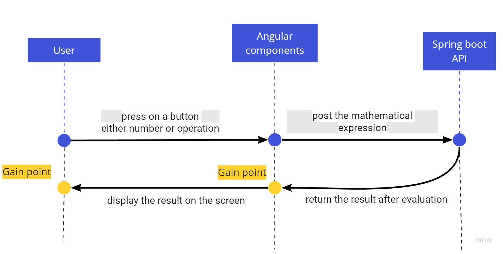

## Overview:
Standard calculator allows calculations for one operation at a time. 
Front-end was made by angular framework and back-end was made by 
spring boot.
## How to Run:
+ First, run the local API from 
Calculator-API\src\main\java\com\example\Calculator_API on port 8080.
+ Second, open the cmd and open angular project.
## Data Flow:

## User Guide:
+ User is allowed to calculate one operation at a time and press ‘=’ 
to calculate it. If he/she adds two operations, the first operation will 
be calculated with its operands, return the result, and add the 
second operation to the right of it.
+ Add operation to any result of any previous evaluation is allowed.
## Errors:
+ Division by zero isn’t allowed.
+ Take the root of a negative number isn’t allowed.
+ Enter a malicious sequence of operations isn’t allowed like `*/`,`*^`,`^/`,…etc
